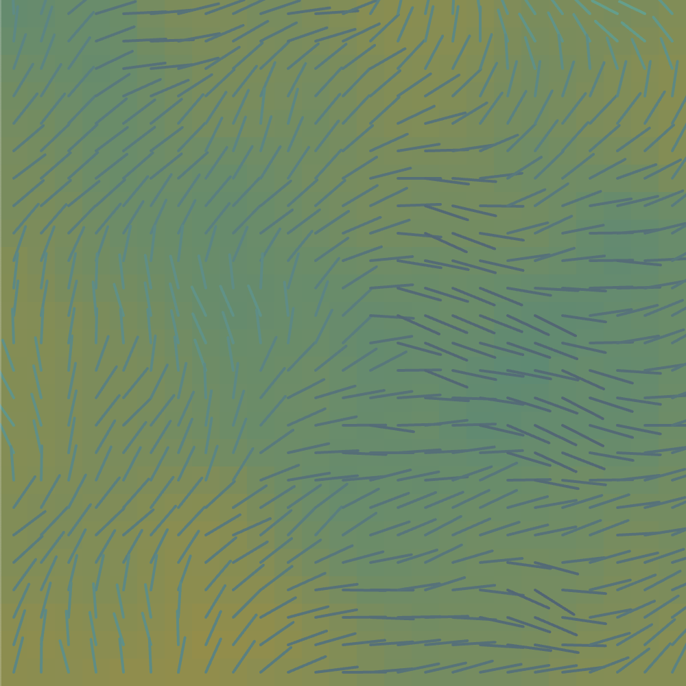

# Noisy Grid

## About

This application is a dynamic art piece created using the p5.js library. It uses Perlin noise to create smooth variations in background colour, compass colour, compass length and compass angle. The speed of the noise can be adjusted based on the mouseX position (horizontal cursor position).